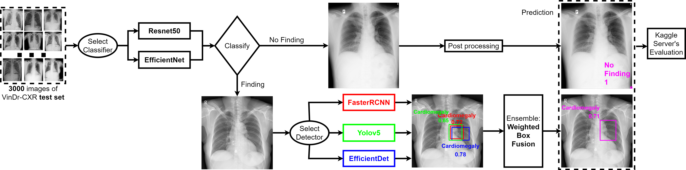

[](https://visitorbadge.io/status?path=https%3A%2F%2Fgithub.com%2Fpvti%2FCXRAbnormalityLocalization)
# 🫁 Chest X-ray abnormalities localization via ensemble of deep convolutional neural networks
<div>
<div align="center">
    <a href='https://github.com/pvti' target='_blank'>Van-Tien Pham<sup>1&#x2709</sup></a>&emsp;
    <a href='https://www.linkedin.com/in/minhtc900/' target='_blank'>Cong-Minh Tran<sup>1</sup></a>&emsp;
    <a href='https://github.com/stanleyjzheng' target='_blank'>Stanley Zheng<sup>2</sup></a>&emsp;
    <a href='https://github.com/Minhvt34' target='_blank'>Tri-Minh Vu<sup>1</sup></a>&emsp;
    <a href='https://www.linkedin.com/in/shantanu-nath-9a7120147/' target='_blank'>Shantanu Nath<sup>3</sup></a>&emsp;

</div>
<div>

<div align="center">
    <sup>1</sup><em>Modelling and Simulation Centre, Viettel High Technology Industries Corporation, Vietnam</em>&emsp;
    <sup>2</sup><em>Kings Distributed Systems, Canada</em>&emsp;
    <sup>3</sup><em>Eutech Systems Ltd, Bangladesh</em>&emsp;
    <sup>&#x2709</sup><em>Corresponding Author</em>
</div>

<div style="text-align: justify"> Convolutional neural networks have been applied widely in chest X-ray interpretation thanks to the availability of high-quality datasets. Among them, VinDr-CXR is one of the latest public datasets including 18000 expert-annotated images labeled into 22 local position-specific abnormalities and 6 globally suspected diseases. A proposed deep learning algorithm based on Faster-RCNN, Yolov5, and EfficientDet frameworks were developed and investigated in the task of multi-class clinical detection from chest radiography. The ground truth was defined by a radiologist-adjudicated image review. Their performance was evaluated by the mean average precision. The results show that the best performance belonged to object detection models ensembled with an EfficientNet classifier, resulting in a peak mAP of 0.292. As a trade-off, ensembling object detection models was much slower, increasing computing time by 3.75, 5, and 2.25 times compared to FasterRCNN, Yolov5, and EfficientDet individually. Overall, the classifiers show constant improvement on all detector models, which is recommended for further research. All of these aspects should be considered to address real-world CXR diagnosis where the accuracy and computing cost are of concern. </div>

<div>
  
</div>


## 👨‍⚕️ News
- **[2021.10.15]** [Video presentation](https://www.youtube.com/watch?v=bJv3Nza3JuM)
[](https://www.youtube.com/watch?v=bJv3Nza3JuM)
- **[2021.08.13]** Paper is accepted at the [2021 International Conference on Advanced Technologies for Communications (ATC)](https://atc-conf.org/).
- **[2021.03.30]** Finnish in top 10%.
- **[2021.03.01]** Build team and join [VinDr-CXR Kaggle competition](https://www.kaggle.com/c/vinbigdata-chest-xray-abnormalities-detection).


## 📋 Main results

Evaluation of the proposed framework on the VinDr-CXR test dataset.

|   Detector   |              | Accuracy (mAP@0.4) |                |       |         Performance         |                      |
|:------------:|:------------:|:------------------:|----------------|:-----:|:---------------------------:|:--------------------:|
|              | Single model |      Resnet50      | EficientNet-B7 | Speed | GPU memory requirement (MB) | Training time (hour) |
| YOLOv5       |     0.21     |        0.246       |      0.269     |   15  |             3291            |           7          |
| FasterRCNN   |     0.248    |        0.263       |      0.278     |   20  |             2076            |          9.5         |
| EfficientDet |     0.269    |        0.28        |      0.273     |   9   |             3685            |          12          |
| Ensemble     |     0.272    |        0.285       |      0.292     |   4   |             3685            |         30.5         |


## 💻 Installation

Please refer to [INSTALL.md](readme/INSTALL.md) for installation instructions.

## 🩺 Model zoo

Trained models are available in the [MODEL_ZOO.md](readme/MODEL_ZOO.md).

## 🔍 Dataset zoo

Please see [DATASET_ZOO.md](readme/DATASET_ZOO.md) for detailed description of the training/evaluation datasets.

## 💉 Getting Started

Follow the aforementioned instructions to install environments and download models and datasets.

[GETTING_STARTED.md](readme/GETTING_STARTED.md) provides a brief intro of the usage of builtin command-line tools.

## 💊 Citing

If you use this work in your research or wish to refer to the results, please use the following BibTeX entry.

```BibTeX
@inproceedings{pham2021chest,
  title={Chest x-ray abnormalities localization via ensemble of deep convolutional neural networks},
  author={Pham, Van-Tien and Tran, Cong-Minh and Zheng, Stanley and Vu, Tri-Minh and Nath, Shantanu},
  booktitle={2021 International Conference on Advanced Technologies for Communications (ATC)},
  pages={125--130},
  year={2021},
  organization={IEEE}
}
```
